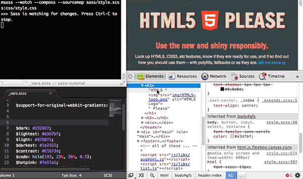

# Sass
#### Mac安装
```
// 前提安装了ruby，检测
ruby －v
// gem仓库站点 https://rubygems.org
sudo gem install sass
// 如果被墙，可直接下载后再安装
sudo gem install path/sass-3.14.18.gem
// 检查安装版本
sass -v
```
#### 更新
```
gem update sass
```
#### 卸载
```
gem uninstall sass
```
#### 编译
##### 编译方式
* 命令编译

```
// 单文件编译
sass <path>/style.scss:<path>/style.css
// 多文件编译
sass <path>/sass/:<path>/css/
// sass --watch
sass --watch test.sass:test.css
sass --watch test.scss:test.css
```
* GUI工具编译
  * Koala (http://koala-app.com/)
  * Compass.app（http://compass.kkbox.com/）
  * Scout（http://mhs.github.io/scout-app/）
  * CodeKit（https://incident57.com/codekit/index.html）
  * Prepros（https://prepros.io/）
* 自动化编译
  * grunt
  * gulp

###### 例子
```
// grunt
module.exports = function(grunt) {
    grunt.initConfig({
        pkg: grunt.file.readJSON('package.json'),
        sass: {
            dist: {
                files: {
                    'style/style.css' : 'sass/style.scss'
                }
            }
        },
        watch: {
            css: {
                files: '**/*.scss',
                tasks: ['sass']
            }
        }
    });
    grunt.loadNpmTasks('grunt-contrib-sass');
    grunt.loadNpmTasks('grunt-contrib-watch');
    grunt.registerTask('default',['watch']);
}
```


```
// gulp
var gulp = require('gulp');
var sass = require('gulp-sass');

gulp.task('sass', function () {
    gulp.src('./scss/*.scss')
        .pipe(sass())
        .pipe(gulp.dest('./css'));
});

gulp.task('watch', function() {
    gulp.watch('scss/*.scss', ['sass']);
});

gulp.task('default', ['sass','watch']);
```
##### 编译输出方式
* 嵌套输出方式 nested
```
sass --watch test.scss:test.css --style nested
```
* 展开输出方式 expanded
```
sass --watch test.scss:test.css --style expanded
```
* 紧凑输出方式 compact
```
sass --watch test.scss:test.css --style compact
```
* 压缩输出方式 compressed
```
sass --watch test.scss:test.css --style compressed
```

###### 例子
```
// sass
nav {
  ul {
    margin: 0;
    padding: 0;
    list-style: none;
  }

  li { display: inline-block; }

  a {
    display: block;
    padding: 6px 12px;
    text-decoration: none;
  }
}
```
```
// nested
nav ul {
  margin: 0;
  padding: 0;
  list-style: none; }
nav li {
  display: inline-block; }
nav a {
  display: block;
  padding: 6px 12px;
  text-decoration: none; }
```
```
// expanded
nav ul {
  margin: 0;
  padding: 0;
  list-style: none;
}
nav li {
  display: inline-block;
}
nav a {
  display: block;
  padding: 6px 12px;
  text-decoration: none;
}
```
```
// compact
nav ul { margin: 0; padding: 0; list-style: none; }
nav li { display: inline-block; }
nav a { display: block; padding: 6px 12px; text-decoration: none; }
```
```
// compressed
nav ul{margin:0;padding:0;list-style:none}nav li{display:inline-block}nav a{display:block;padding:6px 12px;text-decoration:none}
```
#### Sass调试
```
// 早期版本
sass --watch --scss --sourcemap style.scss:style.css
// Sass3.3 版本之上不需要添加 --sourcemap
sass --watch style.scss:style.css
```

## Sass与Scss的区别
.sass只能使用Sass老语法规则（严格tab缩进规则，没看到类似 CSS 中的大括号和分号）

.scss使用的是Sass的新语法规则，也就是 SCSS 语法规则（类似 CSS 语法格式，代码都包裹在一对大括号里，并且末尾结束处都有一个分号）
```
// css样式
body {
  font: 100% Helvetica, sans-serif;
  color: #333;
}
```
```
// Sass实现
$font-stack: Helvetica, sans-serif
$primary-color: #333

body
  font: 100% $font-stack
  color: $primary-color
```
```
// Scss实现
$font-stack: Helvetica, sans-serif;
$primary-color: #333;

body {
  font: 100% $font-stack;
  color: $primary-color;
}
```
#### 声明变量
```
// 声明变量的符号“$”+变量名称:赋予变量的值;
$width: 200px;
// !default表示默认值
$color: #f00 !default;
// sass 的默认变量一般是用来设置默认值，然后根据需求来覆盖的，覆盖的方式也很简单，只需要在默认变量之前重新声明下变量即可。
$baseLineHeight: 2;
$baseLineHeight: 1.5 !default;
body{
    line-height: $baseLineHeight; 
}
```
#### 变量的调用
```
body {
    width: $width;
    color: $color;
    line-height: $baseLineHeight;
}
```
#### 变量的作用域
```
$color: orange !default;//定义全局变量(在选择器、函数、混合宏...的外面定义的变量为全局变量)
.block {
  color: $color;//调用全局变量
}
em {
  $color: red;//定义局部变量
  a {
    color: $color;//调用局部变量
  }
}
span {
  color: $color;//调用全局变量
}
```
#### 嵌套
* 选择器嵌套
```
nav {
  a {
    color: red;

    header & {
      color:green;
    }
  }  
}
```
* 属性嵌套
```
.box {
  border: {
   top: 1px solid red;
   bottom: 1px solid green;
  }
}
```
* 伪类嵌套
```
.clearfix{
&:before,
&:after {
    content:"";
    display: table;
  }
&:after {
    clear:both;
    overflow: hidden;
  }
}
```
